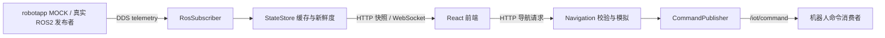
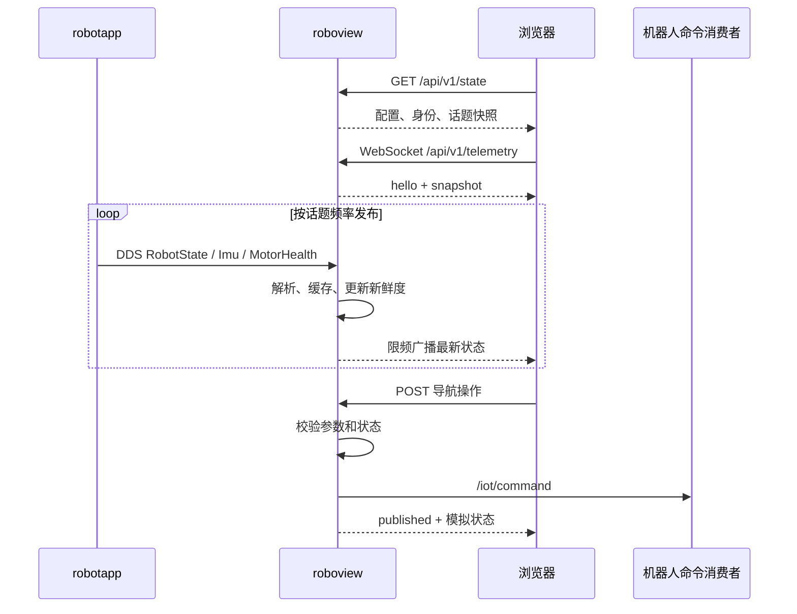

# RoboView · Demo 2.0

面向 LRS-X 人形与 LRD-W 四足轮式机器人的 ROS2 监控与导航演示工程。
项目从 RoboView/LYOS 界面演进，复用 React 页面，以独立 ROS2 节点和 Drogon C++ 服务承载数据。
原始快照在 `Master`，日常开发在 `develop`。

当前验证平台：**Ubuntu 24.04 / x86_64 / ROS2 Jazzy**。Orin NX 交叉编译尚未开放。
导航、建图状态和地图编辑属于内存模拟；命令发布成功不代表实机执行成功。

## 产品能力

| 产品 | 类型 | MOCK 电机数 | 差异动作 | 前端 |
|---|---|---:|---|---|
| lrs-x | humanoid | 26 | 行走、挥手 | 人形关节名称与 URDF 配置 |
| lrd-w | quadruped_wheeled | 16 | 行走、奔跑 | 四足轮式关节名称与 URDF 配置 |

两者共享代码和 ROS 契约，`-p` 同时选择 MOCK 配置、后端配置与前端产品。
支持实时状态、IMU、电机健康分级、话题频率与超时、地图路线和导航模拟。
当前不包含日志管理、资源健康、3D 动态展示和真实运动控制闭环。

## 目录结构

```text
MyRobot/
├── build_all/                       原体系，仅作参考
└── build_all_robot/                 独立 Git 仓库：构建编排与工具链
    ├── build/<产品>/x86_64/         build、install、log
    └── src/myroboview/              本仓库；开发从这里开始
        ├── robot_msgs/node_app_msgs/ 自定义消息契约
        ├── robot_msgs/ros_msgs/     标准消息参考，不参与构建
        ├── robotapp/                MOCK 节点、产品配置、状态机单测
        ├── roboview/
        │   ├── CMakeLists.txt       前后端构建与安装
        │   ├── backend/             Drogon、DDS、核心单测
        │   └── frontend/            React、产品关节配置、URDF 资源
        ├── integration_tests/       跨组件与安装产物验证
        ├── scripts/                 构建、测试、启动入口
        ├── test_reports/            按产品与时间归档，不入 Git
        └── ROS2_DOCS/               契约、路线、评审台账
```

## 模块架构



MOCK 与后端是独立进程，各自读取配置。后端通过 ROS introspection 将消息转换为 JSON，
缓存消息、统计频率并标记 waiting/live/stale/error。React 根据配置渲染指标，按编译产品选择关节映射。
真实机器人接入时停用 MOCK，避免同名话题混流。

## 数据链路与时序



MOCK 只发布 telemetry，不消费导航指令。数据断流后继续广播 stale，页面保留历史值并提示过期。

## 快速开始

前置依赖：ROS2 Jazzy、colcon、CMake/C++ 工具链、Drogon、Node.js/npm。
新机器按外层 README 与 `script/build_tools/install_dependencies.sh` 安装。CI 使用 Node 22。
URDF/mesh 不在 Git 中，需单独准备到 `roboview/frontend/asserts/<产品>/robot_urdf/`。
无资源的 CI 验证页面与 DDS，但报告会明确标记 URDF 检查跳过。

```bash
cd /home/ethan/MyRobot/build_all_robot/src/myroboview
./scripts/build.sh -p lrs-x
./scripts/test.sh -p lrs-x
./scripts/build.sh -p lrd-w
./scripts/test.sh -p lrd-w
```

构建自动执行依赖安装与前端打包。产物在 `../../build/<产品>/x86_64/install/`。
无外层体系时给 build/test 都追加 `--local`，产物在本仓 `install/`；
本地模式共用一个前缀，切换产品后须重新构建再测试。

开发时两个终端使用相同产品：

```bash
# 终端一
./scripts/run_robotapp.sh -p lrs-x
# 终端二
./scripts/start_dev.sh -p lrs-x --no-browser
```

打开 http://127.0.0.1:3000；健康入口 http://127.0.0.1:8080/api/v1/health。
Ctrl+C 退出各自启动进程。LRS-X 后端与 MOCK 联调也可使用 `./scripts/run_demo.sh`。
安装后的后端在 8080 托管生产页面，无需前端开发服务器（Vite 仅承担构建与开发态，见 [前后端构建说明](roboview/README.md)）。

安装布局：`bin/roboview`、`bin/robotapp_node`、`etc/web_config/`、`etc/robotapp/`、`etc/web/`。
后端默认回环监听；启动脚本默认 ROS domain 77 / LOCALHOST，可由环境覆盖。

## 测试与报告

`scripts/test.sh` 执行 CTest、结果汇总、真实 DDS/HTTP/WebSocket 与前端产物检查。
覆盖身份、26/16 电机、动作差异、故障恢复、导航命令，以及静态文件集合和 HTTP 内容。
测试使用临时 HTTP 端口与独立配置，退出时关闭自身进程。

报告在 `test_reports/<产品>/<UTC时间>/`，包含 JUnit、元数据、阶段日志和 CTest 原始记录。
任一阶段失败返回非零。GitHub Actions 双产品矩阵总是归档报告与构建日志，保留 30 天。
目前不执行浏览器 JS；浏览器交互 E2E 仍是后续工作。

通常无需 `make clean`：安装前会整目录清空并重生 `etc/web`（含 static / assets），再按原顺序安装地图与前端产物，防止旧布局与异产品资源残留，同时保留编译缓存。
发布仍建议从干净 staging 目录打包，以避免其他历史安装文件残留。

## 相关文档

- [当前问题、建议与解决历史](ROS2_DOCS/OPTIMIZED.md)
- [消息契约、版本迁移与导航 API](ROS2_DOCS/CONTRACTS.md)
- [ROS2 文档索引](ROS2_DOCS/README.md)
- [阶段路线](ROS2_DOCS/ROADMAP.md) · [架构评估](ROS2_DOCS/ASSESSMENT.md) · [重构方案](ROS2_DOCS/REFACTOR.md)
- [历史验证记录](ROS2_DOCS/VALIDATION.md)
- [MOCK 说明](robotapp/README.md) · [前后端构建说明](roboview/README.md)

历史文档反映各阶段快照；当前行为以代码、契约和最新测试报告为准。
