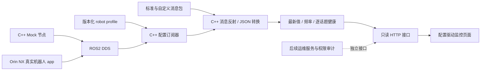

# ROS2 平台化实施计划

## 目标与范围

目标是通用机器人 app 的监控运维入口：以配置选择 ROS2 数据，以小型 Mock 保持可复现，再连接 Orin NX 进行真实部署验证。核心语言 **C++17 / rclcpp**；监控和运维接口与机器人 app 业务解耦。

本轮 P0 以主要后端能力为验收，不要求所有功能；前端优先复用 RoboView。下一步可直接做 P2 中的板端 Demo 编译与联调（2–4 人日）；若要强化为通用只读 MVP，再实施 P1 + P2 全量项。P3–P5 是后续平台能力，不是 Demo 的完成门槛，控制与导航更不在本轮范围。

## 分层架构

- app 负责业务状态、控制执行和设备适配，不让平台猜测厂商状态机。
- 消息包独立发布；核心只依赖 ROS 运行时类型支持，不编译链接每一个设备 SDK。
- 接收层不操作 UI；状态层不下发命令；网页与 ROS 通过版本化协议隔离。
- 当前逐话题最新值轮询适合小规模遥测；后续高频曲线、地图/媒体独立限频和传输，不扩大 JSON 快照为万能总线。

## P0：基线（本轮）

交付：私有 GitHub、Master 初始快照、develop 裁剪版、两个 ament 包、C++ bridge/mock、PlatformStatus、自定义配置、五类遥测、测试及本方案。

验收：独立 colcon 构建、真实 DDS 通路、字段转换、超时/恢复与 HTTP 只读测试。实际环境和未通过板端验证的边界见 [VALIDATION.md](VALIDATION.md)。

## P1：契约与配置加固（3–5 人日）

1. 固定 schema v1 和消息契约，定义机器人 profile 目录命名/加载方式。
2. 增加配置校验 CLI：消息包/类型存在、field 路径/单位/数组下标检查，错误定位到配置项。
3. 增加字段禁用、面板类别、显示单位、可选话题和必需话题声明；明确系统健康如何聚合。
4. QoS 可观测性：展示发布端数量、已发现类型、匹配异常，区分“无发布者”“QoS 不兼容”“超时”。
5. Mock 增加可复现随机种子（如果引入噪声）、单话题停止、延迟、频率下降和非法值场景；保留无硬件依赖。
6. 用两个不同 robot profile 验证同一二进制不改代码即可接入（例如双轮底盘与简化机械臂）。

验收：配置错误启动失败且能定位字段；不同 robot profile 的页面与 DDS 接入完全匹配；CI 覆盖 QoS、数组/字符串、错误值、未知字段和恢复。

## P2：Orin NX 只读监控 MVP（4–6 人日）

1. 采集板端硬件/JetPack/L4T/Ubuntu/ROS/RMW 信息，保存环境清单；不默认升级 JetPack。
2. 在 JetPack 6.x / Ubuntu 22.04 上选 ROS2 Humble，先编译相同源码；开发机可以继续 Jazzy，但不要依赖 Jazzy 与 Humble 跨机 DDS 互通。
3. 先在板端运行 C++ Mock + bridge，开发机通过 SSH 转发网页，验证标准与自定义消息。
4. 创建真实 robot profile，停止 Mock；接入现有 app 的 Battery/Imu/JointState/Odometry，补一个轻量 C++ 状态适配发布节点（如 app 尚无通用状态）。
5. 加入 systemd、工作目录/配置路径管理、journald 和 Restart 策略；Mock 永不进入真实运行默认服务。
6. 测量 bridge 自身 CPU/RSS、网页数据大小和接收延迟。Mock CPU 数值不能充当服务性能指标。
7. 验证 8 小时运行、节点重启、话题断流、SSH 断连重连及系统重启自启动。

验收：板端真实数据与 ROS CLI 对照一致；Mock 与真实源不会同时写同名话题；有环境清单、性能记录和回滚步骤。完成 P1+P2 后即达通用只读 MVP。

## P3：通用展示能力（后续可选，4–6 人日）

1. 按配置注册数值卡片、趋势曲线和表格；设置采样上限与历史窗口，避免无界数组。
2. 独立引入 URDF 资产配置、JointState 名称映射、TF/TFStatic；不写死电机顺序和产品型号。
3. Map/Path/Pose/LaserScan 先只读；坐标转换由 TF 契约支撑，明确 frame 和单位。
4. 直接复用原 RoboView 的 React 图表/3D/地图组件，抽离其 LYOS 数据依赖；不为 Demo 重新设计整套前端。
5. 拆分高带宽消息适配通道，设计限频/压缩/背压、慢客户端隔离与数据大小预算。

验收：更换机器人模型和命名空间仅修改配置；无 TF 时明确显示坐标不可用，不绘制错误轨迹；多个客户端不造成不可控带宽增长。

## P4：基础运维与权限（5–8 人日）

1. 明确身份源与角色（观察者/运维/管理员），实现登录、会话、权限校验和审计。
2. `/rosout` 与 diagnostics 接入，增加按节点/等级过滤及有限环形缓存。
3. 受限目录内日志下载、容量限制、保留策略与路径规范化；不继承原版任意业务路径。
4. rosbag2 控制如果确有需求，独立运维节点执行；规定磁盘阈值、运行状态与退出恢复。
5. Nginx/TLS 或现有网关集成、明确监听地址和可信网络边界；当前回环 HTTP 不直接暴露。
6. 明确任务失败、错误消息和操作者反馈；避免仅靠前端隐藏按钮做权限控制。

验收：未授权操作被服务端拒绝，审计可追踪；慢客户端下载不阻塞遥测；磁盘不足与异常路径有测试。

## P5：发布与长期运行（4–6 人日）

1. 固定依赖、编译选项和版本标识；为 Ubuntu22/Humble 和 Ubuntu24/Jazzy 建立 CI。
2. 增加 Orin arm64 构建/集成通道。x86 容器通过不等于 arm64 通过。
3. 形成带版本的部署目录和可切换 current 链接；配置独立于制品，升级前备份并校验版本。
4. 负载目标先设为 20 个小型话题、5 个浏览器、2 Hz 页面刷新，测量后再调整；本轮没有宣称达标。
5. 24 小时长稳、发布者频繁重启、网络扰动、无数据、畸形/过大数据和重启恢复测试。
6. 配置迁移和服务回滚演练；记录磁盘增长、日志轮换、资源占用基线。

验收：可重复构建/部署/回退，发布清单与测试记录完整；故障可通过日志和配置诊断，不依赖开发者手工改源码。

## 可选 P6：运动与导航（另行规划）

确有需求时再实现，预计追加 8–15 人日以上：

- 通用速度命令使用机器人侧 watchdog、限速、控制权租约和松手归零；网页停止按钮不等于硬件急停。
- Nav2 使用标准 action/service，处理 goal/result/cancel、超时、反馈和状态一致性。
- 厂商模式、动作、标定、语音、地图编辑作为能力插件，具备显式发现与授权。
- 控制能力用 Mock service/action 和硬件安全条件独立验收，不通过“看起来正常”的遥测测试替代。

## 每一步的完成规则

每阶段先更新契约/配置示例，再实现代码和边界测试，最后更新验证记录。每个可运行切片独立提交到 develop。尚未获得板端证据的项目写“待验收”，不得勾选完成；Master 始终保持初始参考快照。
